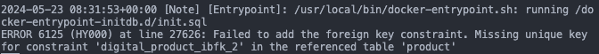

# 20240523

## 1. MySQL 데이터베이스 발생한 ERROR 6125

- 아래와 같이 docker-compose를 이용하여 데이터베이스 컨테이너를 만들려고 했음

```yaml
services:
  database:
    image: mysql:8-oracle
    environment:
      MYSQL_ROOT_PASSWORD: myrootpw
      MYSQL_USER: myuser
      MYSQL_PASSWORD: mypw
      MYSQL_DATABASE: mydb
    tmpfs:
      - /var/lib/mysql
    volumes:
      - ./init.sql:/docker-entrypoint-initdb.d/init.sql
    healthcheck:
      test: ["CMD", "mysqladmin", "ping", "-h", "localhost", "-pshopware"]
      timeout: 20s
      retries: 10
    ports:
      - 3306:3306
```

- 그랬더니 아래와 같은 에러가 발생했음
  

- 관련된 테이블 구문은 아래와 같았음 (불필요한 내용 생략했음)

```sql
CREATE TABLE `product` (
  `id` binary(16) NOT NULL,
  `version_id` binary(16) NOT NULL,

ALTER TABLE `product`
  ADD PRIMARY KEY (`id`,`version_id`),
) ;
```

```sql
CREATE TABLE `digital_product` (
  `id` binary(16) NOT NULL,
) ;

ALTER TABLE `digital_product`
  ADD PRIMARY KEY (`id`),
  ADD KEY `product_id` (`product_id`);

ALTER TABLE `digital_product`
  ADD CONSTRAINT `digital_product_ibfk_1` FOREIGN KEY (`product_id`) REFERENCES `product` (`id`);
```

- 에러 코드를 알아보니 최근에 mysql 8.4.0 버전으로 업데이트되면서 생긴 문제로 보였음
- 데이터베이스 초기화 시 사용하는 init.sql 파일을 다 수정해야하나 싶었는데, 이 대신 mariadb를 아래와 같이 한번 가져와봤음

```yaml
services:
  database:
    image: mariadb:11.3.2
    environment:
      MARIADB_ROOT_PASSWORD: myrootpw
      MARIADB_USER: myuser
      MARIADB_PASSWORD: mypw
      MARIADB_DATABASE: mydb
    tmpfs:
      - /var/lib/mysql
    volumes:
      - ./init.sql:/docker-entrypoint-initdb.d/init.sql
    healthcheck:
      test:
        [
          "CMD",
          "healthcheck.sh",
          "--su-mysql",
          "--connect",
          "--innodb_initialized",
        ]
      timeout: 20s
      retries: 10
    ports:
      - 3306:3306
```

- 다행히도 ERROR 6125가 발생하지 않고 정상 작동하였음

<참고 자료>

- [FIVE SURPRISES IN MYSQL 8.4 LTS - Foreign key restrictions](https://www.skeema.io/blog/2024/05/14/mysql84-surprises/#foreign-key-restrictions)
- [mariadb - dockerhub](https://hub.docker.com/_/mariadb)
- [mysql - dockerhub](https://hub.docker.com/_/mysql)
